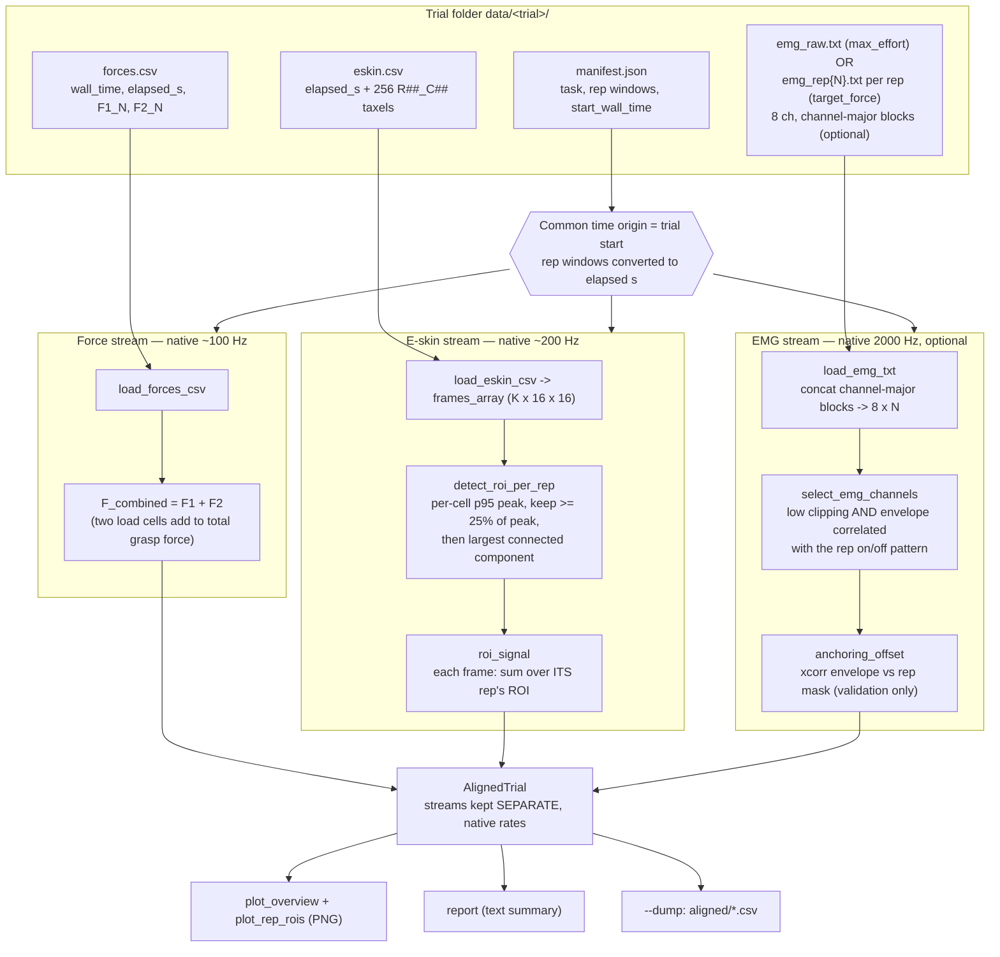

# Trial alignment pipeline

How a recorded trial's three streams — **e-skin**, **force**, and **EMG** — are
loaded and put onto one common time axis for comparison.

This stage does **alignment, not fusion**: every stream is kept at its own
native sample rate and in its own array. There is *no* resampling onto a shared
grid and *no* merged table here. The output is an inspectable, per-stream view
(`AlignedTrial`) plus two plots, so the streams can be eyeballed and validated
against the labelled rep windows before any modelling.

Entry point: `python -m scripts.align_trial <trial_or_parent_folder>`
Core module: [`src/processing/align.py`](../src/processing/align.py)

## Pipeline

## Steps in detail

### 1. Common time origin

`forces.csv` and `eskin.csv` both carry an `elapsed_s` column measured from the
**same** trial-start instant (the recorder sets one origin for the trial), so
`elapsed_s` is used directly as the common axis for those two streams.

The EMG txt has **no timestamps**, so it is timed off its nominal **2000 Hz**
rate; where it is anchored depends on how it was captured. `max_effort` trials
(and older `target_force` recordings) get one whole-trial `emg_raw.txt`,
**anchored at elapsed 0** (trial start): `t[i] = i / 2000`. Newer
`target_force` trials instead capture EMG **per hold attempt** (see
`tasks.py`'s per-rep buffering, below) — the EMG start/stop hotkey fires at
the start/end of every hold attempt, not once for the whole trial, so each
capture stays short regardless of how long a rep's stabilizing retries take.
This produces one `emg_rep{N}.txt` per successfully-completed rep, each
anchored at **that rep's own elapsed start time** (from the manifest's rep
windows) rather than 0; `align_trial` concatenates the segments in rep order,
picking this per-rep shape when present and falling back to the single
whole-trial file otherwise.

The manifest's rep windows are wall-clock; they are converted to elapsed
seconds relative to `start_wall_time` (the same origin) so the windows, force,
e-skin, and EMG all share one axis.

> **Sync caveat.** EMG and the e-skin/force boards are independently triggered,
> so sample-perfect sync is not guaranteed. `anchoring_offset` *reports* the
> residual EMG-vs-rep-window offset as a validation; it does not correct it.

### 2. Force — how the two sensors are merged

The two handle load cells `F1` and `F2` are **summed**:
`F_combined = F1_N + F2_N` (via `forces.load_forces_csv`). They sit on opposite
sides of the grip and their readings **add up to the total grasp force**, so the
sum is the physically meaningful quantity. `F1`/`F2` are also kept individually
for inspection. Native rate (~100 Hz) is preserved.

### 3. E-skin — how the 256 taxels are merged (ROI)

Summing all 256 taxels drowns a real contact in baseline noise from cells that
never touch anything, so instead we isolate the **contact patch (ROI)** and sum
only that.

- **Metric = per-cell peak pressure** (95th percentile over the window's
  frames). Untouched cells read ~0; contact cells reach high pressure. This
  separates contact from no-contact for both transient (squeeze) and sustained
  (hold) grasps. Temporal *std* is deliberately **not** used — steady contact in
  a hold barely varies, so std would pick noisy/flaky cells and miss the real
  contact.
- **Threshold + largest connected component.** Cells whose peak is `>= 25%` of
  the grid peak are candidates; the **largest 4-connected cluster** is kept,
  which drops isolated faulty/edge cells.
- **Per-rep ROI.** Each rep is a fresh grip that can land on a different patch,
  so the ROI is computed **per rep window** (`detect_roi_per_rep`), not once for
  the whole trial. `roi_signal` then aggregates each frame with the ROI of the
  rep it belongs to (rest frames use the union of all rep ROIs; they read ~0
  anyway). The per-frame e-skin scalar is the **sum over that ROI**.

### 4. EMG — channel selection and validation

> **Why per-rep capture for `target_force`.** The EMG capture tool
> (`EMG_Eyetracker_Tool`) buffers a whole start/stop window in memory and only
> writes it to disk once, on stop — by its own admission "suitable for short
> trials (1-2 mins)". `target_force` trials' unbounded stabilizing retries can
> make a trial's real length balloon well past that, which was silently
> truncating or losing EMG entirely. Capturing per hold-attempt instead keeps
> every individual capture short. `max_effort` trials have no retry loop, stay
> short, and are unaffected, so they keep one continuous whole-trial capture
> (worth it: it also stays visible through rest periods, which per-rep capture
> deliberately does not).

- **Load** (`load_emg_txt`): each EMG txt file (`emg_raw.txt`, or one
  `emg_rep{N}.txt` per rep) is a sequence of blank-line-separated blocks; each
  block has 8 channel-major lines; concatenating line *k* across blocks
  rebuilds channel *k* → `(8, N)`. For the per-rep case, `align_trial` loads
  each rep's file separately and concatenates them in rep order.
- **Channel selection** (`select_emg_channels`): a channel is "real" if it
  **rarely rails** (clip fraction `<= 15%`) **and** its rectified envelope
  **correlates with the rep on/off pattern** (`>= 0.30`). Disconnected/floating
  channels rail or don't track the reps and are dropped. All channel scores are
  reported (never a silent drop). *Known limitation:* per-rep-only capture
  never records an "off" (rest) sample — every captured sample is inside a rep
  by construction — so this on/off correlation heuristic may not discriminate
  well for `target_force` trials recorded this way; revisit once real per-rep
  data exists.
- **Anchoring check** (`anchoring_offset`): cross-correlate the selected
  channels' envelope against the rep mask; the best lag (within ±6 s) is the
  residual mis-anchoring. `|offset| < 0.5 s` ⇒ well anchored. This uses the
  ground-truth rep windows, so it is robust even when force is sparse/gappy.

EMG is **optional**: a trial without any `emg_raw.txt`/`emg_rep{N}.txt` still
aligns force + e-skin.

### 5. Rep onset detection (`rep_onsets`)

A rep's nominal window (`start_wall_time`..`end_wall_time`) often includes a
reaction-time lead-in before the user actually starts grasping — most visible
in `max_effort` trials, whose one continuous `emg_raw.txt` still has real
"rest" samples between reps to measure a noise baseline against. For each
rep, `_detect_rep_onsets` filters the two active channels
(`emg_txt.combined_channel_envelope` — bandpass → center → rectify → lowpass,
per `project_overview.md`'s method) once over the whole trial, computes a
baseline mean/std from the inter-rep rest gaps, and finds the first point
within `[start_s, end_s]` where the envelope stays above
`baseline_mean + 3·baseline_std` for ≥ 50 ms. That point becomes `onset_s`;
the window is never trimmed past `end_s`. Stored as
`AlignedTrial.rep_onsets`: `[(rep_no, onset_s, onset_detected), ...]`,
parallel to `reps`.

This only works for a genuinely continuous whole-trial recording — a gappy
per-rep capture (`target_force`, current format) has no in-file rest sample to
detect onset against (the capture already starts at hold), so `rep_onsets`
falls back to `(rep_no, start_s, False)` for every rep without attempting
detection. `plot_overview` marks each `onset_s` on the EMG panel (solid line
= detected, dotted = fallback).

### 6. Outputs

- `AlignedTrial` — dataclass holding each stream at its native rate (separate).
- `aligned_overview.png` — EMG envelope / force (`F1+F2`, `F1`, `F2`) / e-skin
  ROI sum on one time axis, rep windows shaded; target±tolerance band drawn for
  `target_force` trials.
- `eskin_rep_rois.png` — one panel per rep: that rep's peak-pressure map with
  its ROI outlined (see whether the grasp region moves between reps).
- `report(...)` — text summary (stream ranges, coverage, EMG channel scan,
  anchoring, per-rep ROI sizes).
- `--dump` — per-stream aligned CSVs under `<trial>/aligned/`.

## Terminology

- **Trial** — one recording of a task (the repo's standard term: `trial_id`,
  `TrialController`, `data/<trial_id>/`).
- **Rep** — one press/hold repetition within a trial (labelled in the manifest
  with start/end wall-clock times).
- **ROI** — region of interest: the contiguous set of e-skin cells under the
  actual contact.
